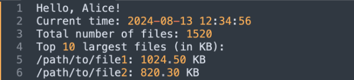
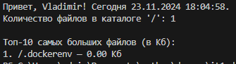

**Задание 1. Создание Docker-контейнера с простым Python-приложением**

**Цель: Научиться создавать Docker-контейнер, который запускает Python-скрипт для анализа файловой системы и вывода приветствия.**

Описание задания:

- Создайте директорию для вашего проекта, например docker\_python\_app, и в ней создайте файл app.py.
- В файле app.py создайте скрипт, который будет выполнять следующие задачи:
1. Вычислять количество файлов в заданном пути (по умолчанию — корневой каталог файловой системы). Задание пути производится следующим образом: в начале скрипта может определяться переменная  path, содержащая путь; если же переменная не определена (закомментирована), то используется вышеупомянутое значение по умолчанию.
1. Выводить топ-10 файлов по размеру (в Кб).
1. Принимать аргумент из командной строки для вывода приветствия с указанным именем, а также текущей даты и времени.
- Теперь создайте Dockerfile в той же директории. Этот файл будет использоваться для сборки Docker-образа.
- Теперь, когда у вас есть Dockerfile и app.py, можно собрать Docker-образ.
- После того, как Docker-образ собран, можно запустить контейнер с вашим приложением. 

После запуска контейнера вы должны увидеть вывод в терминале, который будет включать:

1. Приветственное сообщение с указанным именем и текущим временем.
1. Общее количество файлов в указанном пути.
1. Топ-10 файлов по размеру в указанном пути.

Пример вывода:

Результат задания — После выполнения задания у вас будет Docker-контейнер, который при запуске:

1. Выводит приветственное сообщение с именем пользователя и текущим временем.
1. Вычисляет количество файлов в указанной директории.
1. Выводит топ-10 файлов по размеру.

################## app.py ###############

import os

from datetime import datetime

import getpass

from sys import argv

\# Задание пути

\# path = "C:/users/"  # Задайте путь здесь (закомментируйте для использования корневого каталога)

try:

`    `if os.path.isdir(path):

`        `pass

except:

`    `path = os.path.abspath(os.sep)  # По умолчанию — корневой каталог файловой системы

def get\_top\_10\_largest\_files(directory):

`    `"""Вычисляет количество файлов в заданном каталоге (и подкаталогах)."""

`    `file\_count = 0

`    `"""Возвращает топ-10 файлов по размеру в заданном каталоге (и подкаталогах)."""

`    `files\_with\_sizes = []

`    `for root, dirs, files in os.walk(directory):

`        `if root != path:

`            `break

`        `file\_count += len(files)

`        `for file in files:

`            `try:

`                `file\_path = os.path.join(root, file)

`                `size = os.path.getsize(file\_path) / 1024  # Размер в Кб

`                `files\_with\_sizes.append((file\_path, size))

`            `except OSError:

`                `# Игнорируем ошибки доступа

`                `continue

`    `# Сортировка по размеру (в порядке убывания)

`    `files\_with\_sizes.sort(key=lambda x: x[1], reverse=True)

`    `return file\_count, files\_with\_sizes[:10]

def greet\_user(name):

`    `"""Выводит приветствие с указанным именем и текущей датой/временем."""

`    `now = datetime.now()

`    `print(f"Привет, {name}! Сегодня {now.strftime('%d.%m.%Y %H:%M:%S')}.")

if \_\_name\_\_ == "\_\_main\_\_":

`    `args = argv

`    `# Приветствие

`    `if len(args) > 1:

`        `greet\_user(args[1])

`    `else:

`        `greet\_user(getpass.getuser())

`    `file\_count, largest\_files = get\_top\_10\_largest\_files(path)

`    `# Вывод количества файлов

`    `print(f"Количество файлов в каталоге '{path}': {file\_count}")

`    `# Вывод топ-10 файлов по размеру

`    `print("\nТоп-10 самых больших файлов (в Кб):")

`    `for i, (file\_path, size) in enumerate(largest\_files, start=1):

`        `print(f"{i}. {file\_path} — {size:.2f} Кб")

##################################################################

############## Dockerfile ########################################

FROM python:3.12-slim

WORKDIR /app

COPY app.py .

CMD ["python", "app.py", "Vladimir"]

##################################################################

docker build -t vladok45/it1:v1 .

docker run vladok45/it1:v1

docker login

docker push vladok45/it1:v1
